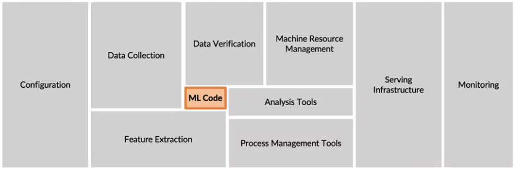
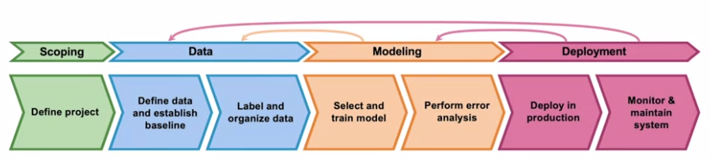
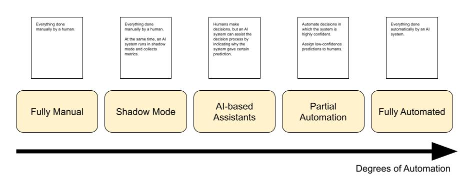

# Machine Learning in Production

# An Overview of MLOps

## ML Infrastructure

## ML Development Cycle

# Deployment

## Deployment Strategies

**Key ideas**: 
* Gradual ramp up with monitoring
* Rollback capabilities

### Shadow Deployment

* ML system runs in parallel to current solution.
* Measures how the system would behave in production without actually using it for decisions.

### Canary Deployment

* Roll out to a small fraction of traffic initially
* Monitor and gradually ramp up traffic

### Blue-Green Deployment

* Blue is old version, green is new version.
* Ramp up traffic from old version to new version.
* If rollback is required, simply route requests back to the old version.

## Degrees of Automation

# Monitoring & Maintenance

**Key concepts**:
* **Training/serving skew**: when the distribution of the data used to train is different than the real-world production data.
* **Concept drift**: changes in $P(Y|X)$. Can be gradual, sudden or recurring (seasonal).
* **Data drift**: changes in $P(X)$, also called feature drift, population shift or covariate shift.

Keep in mind how often data changes. Is it gradual or is it susceptible to shocks?

Examples of shock-causing events:
- Pandemics
- Change in interest rates by central banks
- Technical revamp of a production line
- Major update in an application's UI that changes the customer journey.

In the case of radical shifts, models break. Immediately after the shock you could consider pausing the model until more new data is collected, and falling back to heuristic models.

To get back on track, the model needs retraining:
- Retrain the model using all available data, both before and after the shock.
- Use everything, but assign higher weights to the new data so the model gives priority to the recent patterns.
- If enough new data is collected, you can simply train only with the post-shock data.
- Domain adaptation techniques
- Build a composition of models with old and new data
- Add new data sources
- Try entirely new architectures

## Monitoring Dashboard

Think of all the things that can go wrong, and design metrics or statistics that help you spot those issues for each of the steps of your machine learning pipeline. Set alarm thresholds for these metrics.

* **Software metrics**: memory, compute, latency, throughput, server load
* **Input data metrics**: average sequence length, average audio volume, average pixel brightness, number of missing values
* **Output data metrics**: proportion of null responses, churn, click-through rate
